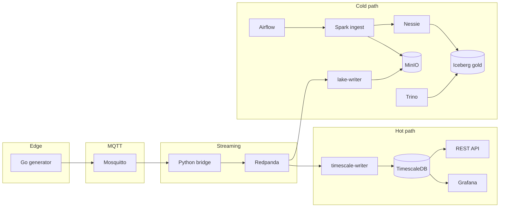

# Enterprise Data Platform (EDP) — telemetry PoC

End-to-end data engineering demo: simulated IoT devices publish energy-style telemetry through a **hot path** (streaming to TimescaleDB and dashboards) and a **cold path** (object storage plus scheduled Spark into an Iceberg lakehouse). Use it as a portable interview or learning stack.

## Architecture



- **Edge:** Go service publishes JSON telemetry to MQTT under `edp/telemetry/{device_id}`.
- **Ingestion:** Python bridge subscribes to `edp/telemetry/#` and produces to the Kafka topic `telemetry_stream`.
- **Hot path:** `timescale-writer` consumes the topic and inserts into TimescaleDB. Grafana and the FastAPI service read from the same database.
- **Cold path:** `lake-writer` buffers Kafka messages to NDJSON objects in MinIO (`landing-zone`). Airflow runs `spark/ingest.py` on a schedule to append into Iceberg (`nessie.gold.sensor_telemetry_historical`) with Nessie as the catalog and MinIO as warehouse storage. Trino is optional SQL over the Iceberg catalog.

## Prerequisites

- Docker and Docker Compose (Compose V2)

## Run the stack

From the **repository root** (so `EDP_REPO_ROOT=${PWD}` resolves correctly for Airflow’s Spark bind mount):

```bash
docker compose up -d --build
```

Check containers:

```bash
docker compose ps
```

## Services and ports

Compose sets `container_name` on each service; use these names with `docker exec`.

| Service | Container name | Host port | Notes |
|--------|----------------|-----------|--------|
| TimescaleDB | `db` | 5432 | Primary hot-path store |
| Grafana | `dashboards` | 3000 | Default admin password: `admin` |
| Mosquitto | `mqtt` | 1883, 9001 | MQTT broker |
| Redpanda | `redpanda` | 9092, 29092 | Kafka-compatible broker |
| Redpanda Console | `redpanda-console` | 8080 | Topic inspection (`telemetry_stream`) |
| Generator | `generator` | — | Publishes to MQTT |
| Bridge | `bridge` | — | MQTT → Kafka |
| Timescale writer | `timescale-writer` | — | Kafka → DB |
| REST API | `rest-api` | 8000 | FastAPI over TimescaleDB |
| MinIO | `minio` | 9000 (S3 API), 9090 (console) | Landing + warehouse buckets |
| Lake writer | `lake-writer` | — | Kafka → MinIO landing zone |
| Nessie | `nessie` | 19120 | Iceberg catalog API |
| Trino | `trino` | 8081 | Query Iceberg via Nessie catalog |
| Airflow | `airflow` | 8085 | Orchestrates Spark batch (DAG `lakehouse_telemetry_ingestion`) |

## One-time database setup

On a fresh Timescale volume, create the hypertable (from repo root):

```bash
docker exec -it db psql -U postgres -d energy_db
```

```sql
CREATE TABLE sensor_telemetry (
    time TIMESTAMPTZ NOT NULL,
    device_id TEXT NOT NULL,
    solar_yield_kw DOUBLE PRECISION,
    battery_soc_pct DOUBLE PRECISION
);

SELECT create_hypertable('sensor_telemetry', 'time');
CREATE INDEX ix_device_time ON sensor_telemetry (device_id, time DESC);
```

## Cold path and Airflow

- The DAG `lakehouse_telemetry_ingestion` runs roughly every five minutes, starting a short-lived Spark container that reads NDJSON from `s3a://landing-zone/telemetry/`, appends to `nessie.gold.sensor_telemetry_historical`, then clears the landing prefix it processed.
- Spark must join the same Docker network as MinIO and Nessie; the project uses Compose **`name: edp`**, so the default network is **`edp_default`** (wired in the DAG).
- **Run `docker compose` from the repository root** so Airflow receives `EDP_REPO_ROOT` pointing at this checkout (used to bind-mount `./spark` into the Spark job). If you start Compose elsewhere, set `EDP_REPO_ROOT` to the absolute path of this repo before bringing up `airflow`.

## Inspecting MQTT traffic

Subscribe to all device topics (matches the Go generator):

```bash
make mqtt
```

This uses topic `edp/telemetry/#` inside the `mqtt` container.

## Trino (optional)

```bash
make trino
```

Uses catalog `nessie`, schema `gold`.

## Tear down

```bash
docker compose down
```

To remove volumes (database, Grafana, MinIO, etc.):

```bash
docker compose down -v
```
