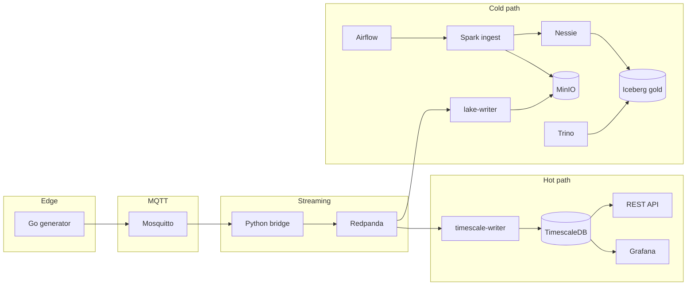

# Enterprise Data Platform (EDP) — telemetry PoC

End-to-end data engineering demo: simulated IoT devices publish energy-style telemetry through a **hot path** (streaming to TimescaleDB and dashboards) and a **cold path** (object storage plus scheduled Spark into an Iceberg lakehouse). This README is written so someone with basic Docker and SQL skills can run the stack and try each component without guessing URLs or credentials.

## Quick vocabulary

| Term | What it means here |
|------|---------------------|
| **MQTT** | Lightweight messaging; the Go “devices” publish small JSON messages to topics like `edp/telemetry/{device_id}`. |
| **Kafka / Redpanda** | A durable log of events. The bridge copies each MQTT message into the topic `telemetry_stream`. |
| **TimescaleDB** | PostgreSQL with time-series features; the `sensor_telemetry` table is a **hypertable** (efficient for time + device queries). |
| **MinIO** | S3-compatible object storage in Docker; holds raw files (landing zone) and Iceberg warehouse files. |
| **Iceberg / Nessie** | Iceberg is the table format on object storage; Nessie is the **catalog** that tracks table versions and branches. |
| **Airflow** | Scheduler that periodically runs the Spark batch job to move data from the landing zone into Iceberg. |
| **Trino** | SQL engine that can query Iceberg tables through the Nessie catalog. |

## Architecture



## Prerequisites

- Docker and Docker Compose (V2): `docker compose version` should work.
- A terminal and a web browser on the same machine that runs Docker.

## First-time setup (from zero to seeing data)

1. **Clone the repository** and open a terminal in the **repository root** (the folder that contains `compose.yml`). This matters because Airflow receives `EDP_REPO_ROOT=${PWD}` for Spark job mounts.
2. **Start everything:**

   ```bash
   docker compose up -d --build
   ```

3. **Wait ~30–60 seconds** for health checks and for services to connect to each other.
4. **Initialize the database once** (only on a fresh volume). The snippet is in [One-time database setup](#one-time-database-setup) below; run it via `docker exec` into `db` and paste the SQL.
5. **Confirm data is moving:**
   - Hot path: [REST API](#rest-api-fastapi) or [TimescaleDB / psql](#timescaledb--psql).
   - Stream: [Redpanda Console](#redpanda-console).
   - Cold path: after several minutes, [MinIO](#minio) and [Airflow](#airflow) / [Trino](#trino) (Iceberg is batch-oriented, not instant).

Simulated device IDs used by the generator (useful for API and SQL examples):

- `factory-roof-01`
- `warehouse-solar-02`
- `office-battery-03`

---

## Day-to-day: Docker Compose

These commands are always run from the **repository root**.

| Goal | Command |
|------|---------|
| Start (or rebuild) the stack | `docker compose up -d --build` |
| See what is running | `docker compose ps` |
| Follow logs for one service | `docker compose logs -f <service_name>` — e.g. `generator`, `bridge`, `timescale-writer`, `lake-writer`, `airflow` |
| Stop containers (keep volumes) | `docker compose down` |
| Stop and **delete** persisted data | `docker compose down -v` |

**Service names** (for `logs`, `restart`, etc.) match the keys in `compose.yml`: `timescaledb`, `grafana`, `mosquitto`, `redpanda`, `generator`, `bridge`, `timescale-writer`, `rest-api`, `minio`, `lake-writer`, `nessie`, `trino`, `airflow`, …

**Container names** (for `docker exec`) are fixed in Compose, e.g. `db`, `mqtt`, `generator`. The [Services and ports](#services-and-ports) table lists both.

---

## Makefile shortcuts

From the repo root:

| Command | What it does |
|---------|----------------|
| `make up` | Same as `docker compose up -d --build` |
| `make down` | `docker compose down --remove-orphans` |
| `make ps` | Compact `docker compose ps` |
| `make psql` | Opens `psql` inside the `db` container |
| `make mqtt` | Installs MQTT clients in `mqtt` and subscribes to `edp/telemetry/#` (live JSON) |
| `make trino` | Opens a Trino CLI in the `trino` container (`nessie` / `gold`) |

---

## Grafana (dashboards)

- **URL:** http://localhost:3000  
- **Login:** user `admin`, password `admin` (unless you changed `GF_SECURITY_ADMIN_PASSWORD` in Compose).  
- Anonymous access may be enabled for demos; if you still see a login screen, use the credentials above.

**Connect to TimescaleDB (if no datasource exists yet)**

1. In Grafana: **Connections → Data sources → Add data source → PostgreSQL**.
2. **Host:** `timescaledb` (Docker network DNS name for the database **service** — not `localhost` from inside Grafana).
3. **Port:** `5432`
4. **Database:** `energy_db`
5. **User / password:** `postgres` / `password123` (defaults from `compose.yml`; change in production).
6. **TLS:** disable for this local stack.
7. **Save & test**, then explore **Explore** to run SQL on `sensor_telemetry`.

**Example query in Explore**

```sql
SELECT time, device_id, solar_yield_kw, battery_soc_pct
FROM sensor_telemetry
ORDER BY time DESC
LIMIT 50;
```

---

## Redpanda Console (Kafka UI)

- **URL:** http://localhost:8080  
- **What to do:** open **Topics**, select **`telemetry_stream`**, then use the **Messages** / consumption view to see live JSON payloads copied from MQTT.

If the topic is empty, check that `generator`, `mqtt`, and `bridge` are running (`docker compose ps`) and see [Troubleshooting](#troubleshooting).

---

## REST API (FastAPI)

- **Base URL:** http://localhost:8000  
- **Interactive docs:** http://localhost:8000/docs (Swagger UI — good for juniors: try requests in the browser).

**Example: last 10 readings for one device**

```bash
curl -s "http://localhost:8000/api/v1/telemetry/factory-roof-01?limit=10" | jq
```

Change the device id or `limit` (max 1000) as needed.

---

## TimescaleDB / psql

**Open a shell on the database**

```bash
make psql
```

or:

```bash
docker exec -it db psql -U postgres -d energy_db
```

**Useful queries**

```sql
-- Latest rows across all devices
SELECT * FROM sensor_telemetry ORDER BY time DESC LIMIT 20;

-- One device
SELECT * FROM sensor_telemetry
WHERE device_id = 'factory-roof-01'
ORDER BY time DESC LIMIT 10;

-- Row counts per device (quick health check)
SELECT device_id, COUNT(*) FROM sensor_telemetry GROUP BY device_id;
```

---

## MQTT (raw device stream)

Topics look like: `edp/telemetry/factory-roof-01`.

**Easiest:** from repo root run `make mqtt` — you should see JSON lines printed as devices publish (about every 5 seconds per device).

**Manual example**

```bash
docker exec -it mqtt sh -c "apk add --no-cache mosquitto-clients && mosquitto_sub -h localhost -t 'edp/telemetry/#' -v"
```

---

## MinIO (object storage)

- **S3 API:** http://localhost:9000  
- **Web console:** http://localhost:9090  
- **Login:** `admin` / `password123` (from `compose.yml`)

**What to look for**

- Bucket **`landing-zone`**: NDJSON batches written by `lake-writer` under keys like `telemetry/YYYY/MM/DD/...`.
- Bucket **`warehouse`**: Iceberg table data (managed by Spark / Nessie; do not delete casually).

If **`landing-zone` does not exist**, create it in the console (**Buckets → Create bucket**). The lake writer expects that bucket name.

---

## Airflow (orchestration)

- **URL:** http://localhost:8085  
- Default credentials are often `airflow` / `airflow` for local images; if login fails, check the image documentation or logs: `docker compose logs airflow | head -50`.

**Typical workflow**

1. Log in and open **DAGs**.
2. Find **`lakehouse_telemetry_ingestion`** (tags: `edp`, `spark`, `iceberg`).
3. **Unpause** the DAG (toggle on the list row).
4. Wait for the schedule (about every 5 minutes) or **Trigger DAG** from the DAG detail page.
5. Open the latest **DAG run → Task → Logs** for `run_spark_iceberg_ingestion` if something fails.

**Important:** run `docker compose` from the **repository root** so `EDP_REPO_ROOT` points at this project; otherwise the Spark container may not mount `spark/ingest.py` correctly. The stack uses Compose project name **`edp`**, so the Docker network for cross-container DNS is **`edp_default`**.

---

## Spark (batch ingest)

You do not run Spark manually in the default setup: **Airflow’s `DockerOperator`** starts a one-off Spark container, runs `spark/ingest.py`, then removes it.

To **debug**, read the task logs in Airflow (above) or inspect Airflow logs:

```bash
docker compose logs -f airflow
```

---

## Nessie (Iceberg catalog)

- **REST API:** http://localhost:19120/api/v1  
- Juniors usually do not need the raw REST API; Trino and Spark already use this URI. For curiosity you can open http://localhost:19120 in a browser depending on image (some builds show a small UI or API root).

Tables created by this project include the Iceberg table **`sensor_telemetry_historical`** in namespace **`gold`** (referenced in SQL as `nessie.gold.sensor_telemetry_historical` from Spark).

---

## Trino (SQL on Iceberg)

**Option A — Makefile (interactive CLI)**

```bash
make trino
```

Then at the `trino>` prompt:

```sql
SHOW TABLES FROM nessie.gold;
SELECT * FROM nessie.gold.sensor_telemetry_historical LIMIT 20;
```

**Option B — Web UI**

- Open http://localhost:8081 (mapped to Trino’s UI inside the container).

If tables are empty, wait for **Airflow** to run successfully after enough data landed in MinIO (cold path is batch-oriented).

---

## One-time database setup

On a **fresh** Timescale volume, create the hypertable once:

```bash
docker exec -it db psql -U postgres -d energy_db
```

```sql
CREATE TABLE sensor_telemetry (
    time TIMESTAMPTZ NOT NULL,
    device_id TEXT NOT NULL,
    solar_yield_kw DOUBLE PRECISION,
    battery_soc_pct DOUBLE PRECISION
);

SELECT create_hypertable('sensor_telemetry', 'time');
CREATE INDEX ix_device_time ON sensor_telemetry (device_id, time DESC);
```

---

## Services and ports

Compose sets `container_name` on each service; use these names with `docker exec`.

| Service | Compose service name | Container name | Host port | Notes |
|---------|----------------------|----------------|------------|--------|
| TimescaleDB | `timescaledb` | `db` | 5432 | Hot-path database |
| Grafana | `grafana` | `dashboards` | 3000 | Default admin password `admin` |
| Mosquitto | `mosquitto` | `mqtt` | 1883, 9001 | MQTT broker |
| Redpanda | `redpanda` | `redpanda` | 9092, 29092 | Kafka-compatible broker |
| Redpanda Console | `redpanda-console` | `redpanda-console` | 8080 | Inspect `telemetry_stream` |
| Generator | `generator` | `generator` | — | Publishes MQTT |
| Bridge | `bridge` | `bridge` | — | MQTT → Kafka |
| Timescale writer | `timescale-writer` | `timescale-writer` | — | Kafka → DB |
| REST API | `rest-api` | `rest-api` | 8000 | FastAPI |
| MinIO | `minio` | `minio` | 9000 (S3), 9090 (console) | Landing + warehouse |
| Lake writer | `lake-writer` | `lake-writer` | — | Kafka → MinIO NDJSON |
| Nessie | `nessie` | `nessie` | 19120 | Iceberg catalog |
| Trino | `trino` | `trino` | 8081 | SQL on Iceberg |
| Airflow | `airflow` | `airflow` | 8085 | Spark batch DAG |

---

## Cold path recap

1. `lake-writer` copies Kafka messages into **MinIO** (`landing-zone`, under `telemetry/...`).
2. **Airflow** runs **`lakehouse_telemetry_ingestion`** on a timer (~5 minutes).
3. **Spark** reads NDJSON from the landing zone, appends to **`nessie.gold.sensor_telemetry_historical`**, then clears processed landing files for that run.
4. **Trino** can query the Iceberg table through the **Nessie** catalog.

---

## Troubleshooting

| Symptom | Things to check |
|---------|-------------------|
| Nothing in Redpanda / DB | `docker compose ps`; `docker compose logs bridge generator mqtt`. |
| `psql` fails or “relation does not exist” | Run [One-time database setup](#one-time-database-setup). |
| Grafana cannot reach Postgres | Datasource host must be **`timescaledb`**, port **5432**, DB **`energy_db`**. |
| MinIO errors in `lake-writer` logs | Ensure bucket **`landing-zone`** exists; credentials match `compose.yml`. |
| Airflow DAG fails immediately | Confirm you started Compose from the **repo root**; check Spark task logs. |
| Trino shows no rows | Cold path is delayed: confirm MinIO has files and Airflow runs completed green. |

---

## Tear down

```bash
docker compose down
```

Remove volumes (wipes DB, Grafana, MinIO, etc.):

```bash
docker compose down -v
```
